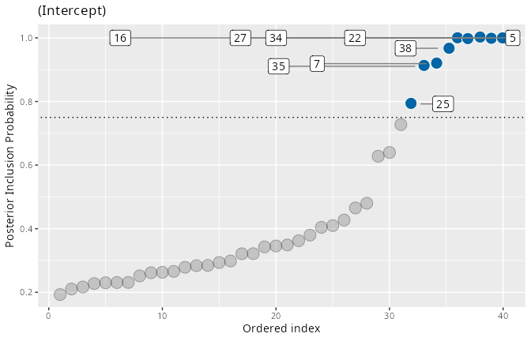
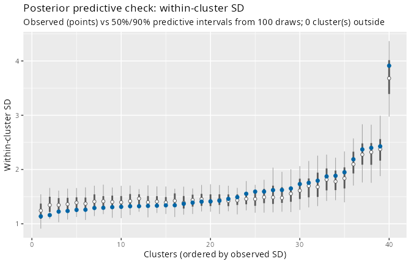
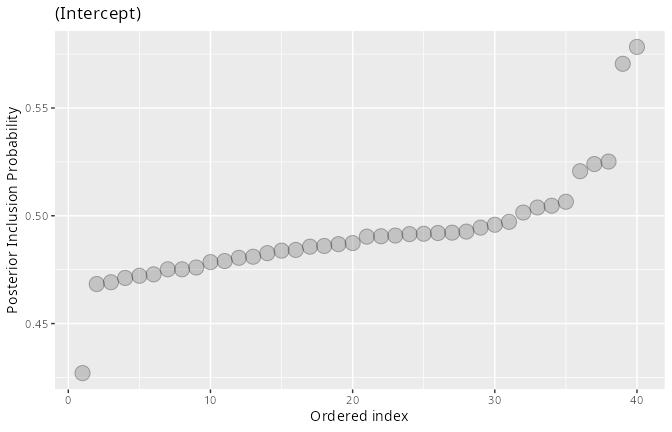

```{r, include = FALSE}
## The models in this vignette take several minutes to fit, so no chunk is
## evaluated at build time. All shown output is the verbatim result of
## running the code with the stated seeds (ivd 1.0.0.9000).
knitr::opts_chunk$set(eval = FALSE, collapse = TRUE, comment = "#>")
```

Two practical questions decide whether an `ivd` analysis can be trusted:

1. **Has the sampler converged for the quantities that matter?** The
   spike-and-slab indicators make some standard diagnostics misleading.
2. **Is the likelihood adequate?** Heavy-tailed data can *masquerade* as
   variance heterogeneity, producing confidently wrong PIPs.

This vignette demonstrates both failure modes on simulated data -- where we
know the truth -- and the tools that catch them.

## Part 1: Convergence for spike-and-slab models

We reuse the simulation from
`vignette("interpreting-pips", package = "ivd")`: 40 clusters, of which
5, 13, 27 and 38 have a within-cluster SD 2.5 times the baseline.

```{r}
library(ivd)

sim <- simulate_ivd(J = 40, n_j = 50, deviant_clusters = c(5, 13, 27, 38),
                    deviant_factor = 2.5, seed = 123)
```

### What an underfitted run looks like

First a run that is deliberately far too short:

```{r}
short <- ivd(y ~ 1 + (1 | id), ~ 1 + (1 | id), data = sim$data,
             niter = 300, nburnin = 300, workers = 4, seed = 456)
#> Warning: Some R-hat values are greater than 1.10 -- increase warmup and/or
#> sampling iterations.
short
#>  ...
#>  Diagnostics: max split-Rhat = 26.861, min n_eff = 10
```

The Rhat warning fires, but the more actionable diagnostic is
`pip_diagnostics()`: it checks the thing you will actually report -- the
per-cluster classification -- for agreement across chains:

```{r}
pip_diagnostics(short)
#> PIP Monte Carlo diagnostics (4 chains, classification at PIP >= 0.75)
#>
#>   Max. MCSE of a PIP:              0.217
#>   Max. between-chain PIP range:    0.877
#>   4 of 40 PIPs are classified inconsistently across chains (see below);
#>   consider more iterations before classifying these clusters.
#>
#>    scale_var cluster_id   pip chain1 chain2 chain3 chain4  mcse range
#>  (Intercept)          5 0.783  0.133      1      1  1.000 0.217 0.867
#>  (Intercept)         13 0.792  0.170      1      1  0.997 0.207 0.830
#>  (Intercept)         27 0.783  0.187      1      1  0.947 0.199 0.813
#>  (Intercept)         38 0.743  0.123      1      1  0.847 0.210 0.877
```

This is as bad as it gets, and the pooled numbers hide it: the pooled PIPs
(~0.78) look like solid detections, but chain 1 assigns these clusters to
the *spike* (PIP 0.12--0.19) while the other chains assign them to the
*slab* with near certainty. (These are, in fact, exactly the four truly
deviant clusters -- chain 1 simply had not found the slab yet.) A pooled
PIP of 0.78 built from chains that disagree this much is not evidence; it
is an average over disagreement.

### The same model, run properly

```{r}
fit <- ivd(y ~ 1 + (1 | id), ~ 1 + (1 | id), data = sim$data,
           niter = 2000, nburnin = 2000, workers = 4, seed = 456)
pip_diagnostics(fit)
#> PIP Monte Carlo diagnostics (4 chains, classification at PIP >= 0.75)
#>
#>   Max. MCSE of a PIP:              0.036
#>   Max. between-chain PIP range:    0.157
#>   All 40 PIPs are classified consistently across chains.
```

All four truly deviant clusters now sit at PIP 1.000 in every chain.

Two related notes:

- **Global Rhat can stay high even when the PIPs are stable** (this fit
  reports max split-Rhat 1.26). The worst Rhat values belong to individual
  random-effect draws whose chains disagree only while the corresponding
  inclusion indicator switches between spike and slab -- behaviour that is
  intrinsic to the model, not a sign of a broken run. Judge the *PIPs* by
  `pip_diagnostics()`, and judge the fixed effects and variance components
  by their own Rhat/n_eff rows in `summary()`.
- **More chains are cheap.** Chains are decoupled from workers, and each
  worker compiles the model once and reuses it, so
  `ivd(..., chains = 8, workers = 4)` costs extra sampling time but no
  extra compilation. More chains make the between-chain checks in
  `pip_diagnostics()` considerably sharper.

## Part 2: Heavy tails masquerading as variance heterogeneity

The gaussian likelihood interprets every excess spread as variance. If the
residuals are heavy-tailed, clusters that merely catch a few outliers can
be flagged with total confidence. To demonstrate, we simulate data with
student-t residuals (df = 3) and **no deviant clusters at all**:

```{r}
sim_t <- simulate_ivd(J = 40, n_j = 50, n_deviant = 0,
                      family = "student", df = 3, seed = 321)
```

### The gaussian fit is confidently wrong

```{r}
fit_g <- ivd(y ~ 1 + (1 | id), ~ 1 + (1 | id), data = sim_t$data,
             niter = 1500, nburnin = 1500, workers = 4, seed = 99)
sum(pip(fit_g)$pip >= 0.75)
#> [1] 9
max(pip(fit_g)$pip)
#> [1] 1
```

```{r}
plot(fit_g, type = "pip")
```



Nine of forty clusters -- nearly a quarter -- exceed the 0.75 threshold,
some with PIP 1.000, in data where *no* cluster deviates. Note that the
gaussian fit's own `pp_check()` does not catch this: the model absorbs the
tails *into* the cluster variances, so its replicated within-cluster SDs
match the observed ones.

```{r}
pp_check(fit_g, ndraws = 100, seed = 1)
```



### The student-t fit absorbs the tails

`family = "student"` replaces the gaussian likelihood with a student-t
whose degrees of freedom `nu` are estimated from the data:

```{r}
fit_t <- ivd(y ~ 1 + (1 | id), ~ 1 + (1 | id), data = sim_t$data,
             niter = 1500, nburnin = 1500, workers = 4, seed = 99,
             family = "student")
sum(pip(fit_t)$pip >= 0.75)
#> [1] 0
max(pip(fit_t)$pip)
#> [1] 0.578
```

```{r}
plot(fit_t, type = "pip")
```



Every false detection disappears, and the tail-heaviness is recovered
where it belongs -- in `nu`:

```{r}
summary(fit_t)$table["nu", ]
#>    Mean    SD Time-series SE 2.5% 50% 97.5% n_eff R-hat
#> nu 3.31 0.251           0.01 2.86 3.3  3.81   417     1
```

The estimate brackets the true df of 3 tightly.

### Deciding between the two likelihoods

Since the gaussian fit's SD-based `pp_check()` looks clean, compare the
families on predictive grounds: WAIC.

```{r}
summary(fit_g)$waic
#> [1] 7641.5
summary(fit_t)$waic
#> [1] 7119.7
```

The student-t model wins by a wide margin (~520 WAIC units). The practical
rule:

- fit both families when heavy tails are plausible;
- if WAIC clearly prefers `"student"` and the PIPs collapse while `nu`
  comes out small (say below 10), the "variance heterogeneity" was tails;
- if `nu` is estimated large (30+) and the PIPs barely move, the gaussian
  fit is fine -- the t nests it.

Two caveats worth knowing: the student-t scale model describes the *scale*
`tau` of the t distribution (its SD is `tau * sqrt(nu/(nu-2))`; plots
label the axis accordingly), and student fits typically need more
iterations than gaussian ones to mix -- confirm with `pip_diagnostics()`
before interpreting.

## Checklist

1. `print(fit)`: sane max split-Rhat / min n_eff for the model as a whole.
2. `pip_diagnostics(fit)`: no `unstable` classifications; small MCSEs.
3. `pp_check(fit)`: observed within-cluster SDs inside their predictive
   intervals.
4. If tails are plausible: refit with `family = "student"` and compare
   WAIC and PIPs.
5. Underpowered or undecided? Increase `niter`/`nburnin`, or add chains
   (`chains > workers` costs no extra compilation).
