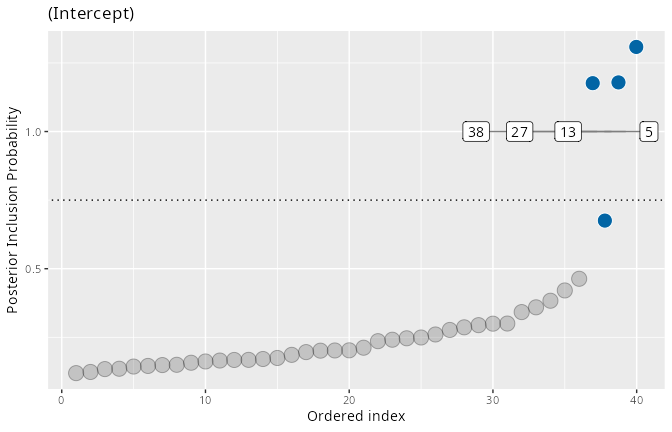
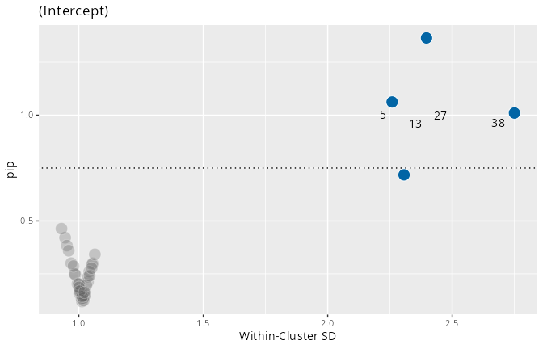
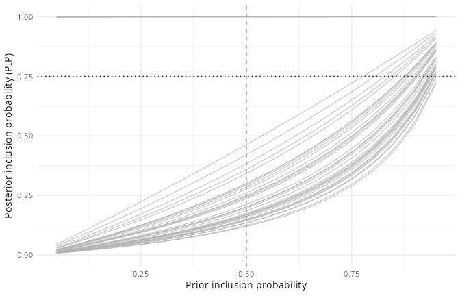

```{r, include = FALSE}
## The models in this vignette take several minutes to fit, so no chunk is
## evaluated at build time. All shown output is the verbatim result of
## running the code with the stated seeds (ivd 1.0.0.9000).
knitr::opts_chunk$set(eval = FALSE, collapse = TRUE, comment = "#>")
```

The headline output of an `ivd` fit is one **posterior inclusion
probability (PIP)** per cluster (school, participant, ...) and random scale
effect: the posterior probability that the cluster's residual-variance
random effect belongs to the *slab* rather than the *spike* -- in other
words, that the model needs a cluster-specific deviation from the average
residual variance. A large PIP flags a cluster that is substantially more
(or less) variable than the others; whether it is more or less variable is
read off the sign of the associated random effect (`u_mean` in `pip()`).

PIPs convert directly to posterior odds: a PIP of 0.75 means the cluster is
three times as likely to belong to the slab as to the spike. With the
default prior inclusion probability of 0.5 those odds are also Bayes
factors.

This vignette walks through the tools for *interpreting* PIPs on data where
the truth is known, using the package's own simulator.

## A simulation with known deviant clusters

`simulate_ivd()` generates data from the intercept-only mixed-effects
location-scale model with a chosen set of deviant clusters. Here, clusters
5, 13, 27 and 38 get a within-cluster SD 2.5 times the baseline:

```{r}
library(ivd)

sim <- simulate_ivd(J = 40, n_j = 50, deviant_clusters = c(5, 13, 27, 38),
                    deviant_factor = 2.5, seed = 123)
sim
#> Simulated MELSM data: 40 clusters, 2000 observations
#>   Baseline within-cluster SD: 1 (location grand mean 0, tau_loc 0.5)
#>   4 deviant cluster(s): 5, 13, 27, 38 (SD factor 2.5)
```

```{r}
fit <- ivd(y ~ 1 + (1 | id), ~ 1 + (1 | id), data = sim$data,
           niter = 2000, nburnin = 2000, workers = 4, seed = 456)
fit
#> Individual variance detection (ivd) model
#>
#>  Location: y ~ 1 + (1 | id)
#>  Scale:    ~1 + (1 | id)
#>  Data:     2000 observations in 40 clusters
#>  Sampling: 4 chains, 2000 post-warmup draws each
#>  Diagnostics: max split-Rhat = 1.259, min n_eff = 19
```

(The max split-Rhat looks alarming; it belongs to individual random-effect
draws whose chains disagree only while their inclusion indicator is
switching. Whether that matters for the PIPs themselves is exactly what
`pip_diagnostics()` answers below; see also
`vignette("convergence-and-robustness", package = "ivd")`.)

## Reading the PIPs

`pip()` returns one row per cluster and scale random effect:

```{r}
pips <- pip(fit)
head(pips[order(-pips$pip), ], 6)
#>      scale_var cluster_index cluster_id   pip  u_mean  u_sd
#> 5  (Intercept)             5          5 1.000  0.8028 0.103
#> 13 (Intercept)            13         13 1.000  0.8217 0.102
#> 27 (Intercept)            27         27 1.000  0.8632 0.100
#> 38 (Intercept)            38         38 1.000  0.9932 0.103
#> 25 (Intercept)            25         25 0.463 -0.0853 0.116
#> 10 (Intercept)            10         10 0.421 -0.0698 0.105
```

The four planted deviant clusters are recovered with PIP 1.000, well
separated from the rest, and their positive `u_mean` values correctly
identify them as *more* variable than the baseline. The same information is
available graphically:

```{r}
plot(fit, type = "pip")
```



The funnel plot relates each cluster's PIP to its estimated within-cluster
SD, showing at a glance which flagged clusters are unusually consistent
(left arm) versus unusually inconsistent (right arm):

```{r}
plot(fit, type = "funnel")
```



## From PIPs to decisions: `pip_fdr()`

The conventional threshold of `PIP >= 0.75` (posterior odds 3:1) is a
convention, not a law. When you need a defensible cutoff, `pip_fdr()`
selects the largest set of clusters whose estimated **Bayesian false
discovery rate** -- the average of `1 - PIP` among the selected -- stays
below a target level (Newton et al., 2004). The implied threshold adapts to
the data:

```{r}
pip_fdr(fit, fdr = 0.05)
#> Bayesian FDR decision rule (target FDR <= 0.05)
#>
#> Random scale effect: (Intercept)
#>   Selected 4 of 40 clusters (implied PIP threshold >= 1.000, expected FDR = 0.000):
#>  cluster_id pip local_fdr cum_fdr
#>           5   1         0       0
#>          13   1         0       0
#>          27   1         0       0
#>          38   1         0       0
```

Exactly the four true deviant clusters are selected, with an expected FDR
of zero. On real data the selection is rarely this clean; the returned data
frame carries every cluster's `local_fdr` and the running `cum_fdr` so you
can see how quickly the expected error accumulates as the threshold is
relaxed, and `attr(sel, "thresholds")` can be fed straight into
`plot(fit, pip_level = ...)`.

## Is the classification robust to the prior? `pip_sensitivity()`

PIPs depend on the prior inclusion probability (`ss_prior_p`, 0.5 by
default). `pip_sensitivity()` recomputes them analytically over a grid of
priors -- no refitting -- by converting the posterior odds to
prior-independent Bayes factors:

```{r}
sens <- pip_sensitivity(fit)
plot(sens)
```



Clusters whose classification at the threshold flips within a plausible
perturbation of the fitted prior (halving to doubling its odds, by
default) are highlighted; classifications that survive the whole window can
be reported without a prior caveat.

## Is the PIP itself trustworthy? `pip_diagnostics()`

A PIP is the posterior mean of a binary indicator, so the usual split-Rhat
is not informative for it. `pip_diagnostics()` reports each PIP's Monte
Carlo error and -- most importantly -- whether the *classification* agrees
across chains:

```{r}
pip_diagnostics(fit)
#> PIP Monte Carlo diagnostics (4 chains, classification at PIP >= 0.75)
#>
#>   Max. MCSE of a PIP:              0.036
#>   Max. between-chain PIP range:    0.157
#>   All 40 PIPs are classified consistently across chains.
```

Despite the noisy-looking global Rhat above, every one of the 40 PIPs is
classified the same way by all four chains -- the quantity this package is
actually about is stable. Clusters flagged `unstable` here should not be
classified either way without more iterations.

## The full workflow

1. Fit with `ivd()` and check `print(fit)` and `pip_diagnostics(fit)`.
2. Inspect `plot(fit, type = "pip")` and the funnel plot.
3. Choose the cutoff deliberately: the 0.75 convention, or
   `pip_fdr(fit, fdr = ...)` for an error-rate-controlled selection.
4. Confirm the selection is prior-robust with `plot(pip_sensitivity(fit))`.
5. Report the selected clusters with their PIPs, `u_mean` direction, and
   the decision rule used.

## References

Newton, M. A., Noueiry, A., Sarkar, D., & Ahlquist, P. (2004). Detecting
differential gene expression with a semiparametric hierarchical mixture
method. *Biostatistics*, 5(2), 155--176.

Carmo, M., Williams, D. R., & Rast, P. (2026). Beyond average scores:
Identification of consistent and inconsistent academic achievement in
grouping units. *Journal of Educational and Behavioral Statistics*.
